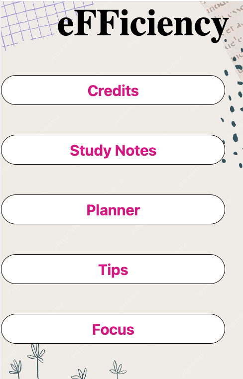

# 📱 SAAR Hackathon App – Timetable and Scheduling

A mobile application developed during a hackathon to **simplify personal scheduling** by consolidating multiple timetables into one interactive app.  
The app integrates features such as a **Pomodoro timer, mood tracker, planner calendar, study notes, and productivity tips** to help users stay organized and focused.

---

## Tech Stack

- **Languages:** JavaScript, CSS, HTML
- **Frameworks/Libraries:** React Native, Expo  

---

## Key Highlights

- Built the **core flow**, including timetable creation and editing, in [X hours/days]  
- Designed UI and logic for **dynamic schedule conflict detection and notifications**  
- Next Steps:  
  - Integrate calendar syncing with **Google / Outlook**  
  - Add **real-time collaboration** for group scheduling  

---

## Demo

| Home Screen | 
|--------------|
|  

---
